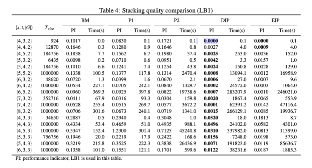

# 程序说明
- Version one：tensorflow框架 / 有图形交互功能，代码参照莫凡python，只训练一个到达队列，
- Version two（可以跑）：pytorch / 状态为贝位状态+新到达集装箱 / 动作直接输出4个Q值，遇到已满的堆垛用[1,0,1,1]向量乘，使得选该堆垛概率为0
- Version three：pytorch / 状态为单个堆垛状态，输出堆垛评分，选择评分高的堆垛
- Version four（可以跑）：pytorch /  状态为贝位状态+新到达集装箱 / 遇到已满的堆垛给大惩罚值，且回合结束

结果查看model文件夹下的.txt
LB1越小越好
PI = LB1/T_size
